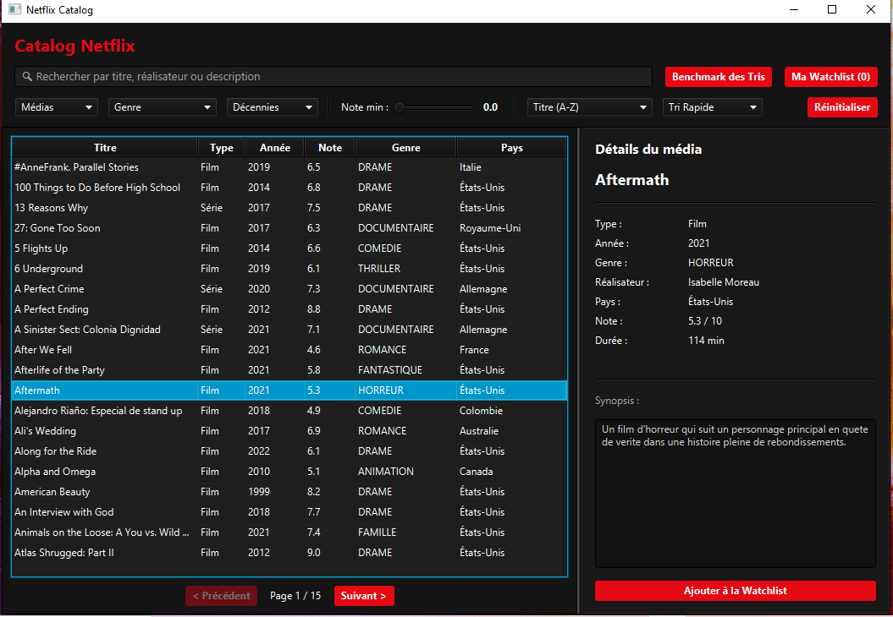
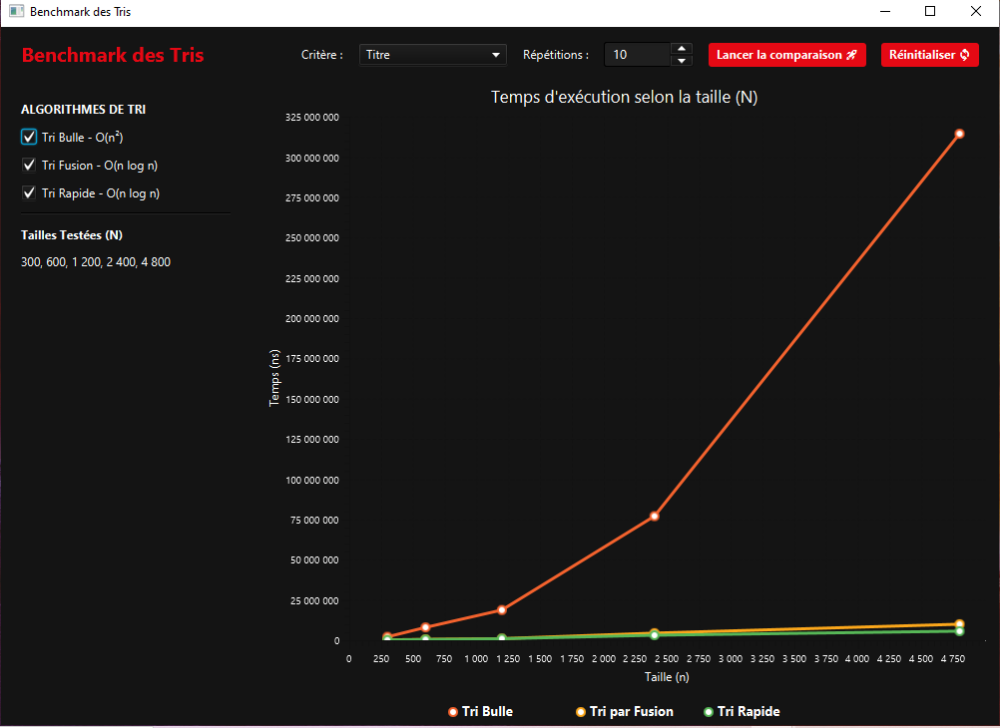
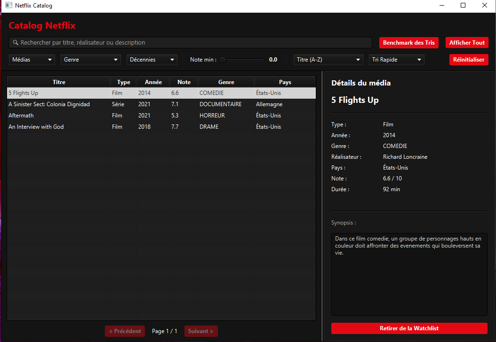

# Netflix Catalog - Lab2

**Cours** : 420-930-MA — Algorithmes et modèles de programmation
**Session** : Été 2026, groupe 25604
**Laboratoire** : 2 (Application JavaFX v1)
**Date de remise** : 13 septembre 2026, 23h59

---

## Équipe

| Nom complet | Adresse courriel | Contribution principale |
|-------------|------------------|--------------------------|
| Gabriel Cadieux | gabrielcadieux96@gmail.com | Modèle, Algorithmes, Util, Service, Controller, UI FXML, CSS, Tris, Filtres |
| Fadhel Smari | smarifadhel@gmail.com | Data, Modèle, Algorithmes, Util, Benchmark, Service, Controller, UI FXML, Tris, CSS |


---

## Sujet choisi

* **Numéro du sujet** : 1
* **Nom du sujet** : Netflix Catalog

---

## 🔗 Lien du dépôt GitHub PUBLIC

**URL** : https://github.com/Fadhel-Smari/Netflix-Catalog

---

## Fonctionnalités implémentées

### ✅ Obligatoires (cocher ce qui est fait)

- [x] Architecture MVC avec packages séparés (model / service / algorithmes / controller / util)
- [x] Chargement des données depuis fichier CSV (nombre de lignes : 300)
- [x] Interface JavaFX principale avec liste/tableau
- [x] Panneau détail affichant l'élément sélectionné
- [x] Pagination fonctionnelle (taille de page : 20 Médias par page)
- [x] Filtres multi-critères combinables (nombre implémentés : 4 / 4)
- [x] Recherche par texte en temps réel
- [x] Interface Algorithme définie
- [x] Tri #1 implémenté : Tri Bulle
- [x] Tri #2 implémenté : Tri Merge
- [x] Tri #3 implémenté : Tri Rapide
- [x] Comparateur/benchmark des tris avec mesure du temps
- [x] Wishlist / Favoris (ajout, retrait, pas de doublons)
- [x] CSS appliqué (thème visuel du projet)

### 🎁 Bonus (cocher ce qui est fait)

- [ ] [Bonus 1 : ex. Mode sombre/clair]
- [ ] [Bonus 2 : ex. Statistiques]
- [ ] [Bonus 3 : ...]

### ❌ Non implémenté (assumer honnêtement)

- *N/A*

---

## Structure du projet

```
Netflix-Catalog/
├── pom.xml
└── src/main/
    ├── java/
    │   ├── module-info.java
    │   └── com/maisonneuve/netflix/
    │       ├── Launcher.java 
    │       ├── MainFx.java
    │       ├── model/
    │       │   ├── Media.java
    │       │   ├── Film.java
    │       │   ├── Serie.java
    │       │   ├── Genre.java
    │       │   ├── StatutSerie.java
    │       │   └── Watchlist.java
    │       ├── service/
    │       │   ├── MediaService.java
    │       │   └── BenchmarkService.java
    │       ├── benchmark/
    │       │   ├── Chronometre.java
    │       │   └── ResultatMesure.java
    │       ├── algorithmes/
    │       │   ├── Algorithme.java
    │       │   ├── TriBulle.java
    │       │   ├── TriMerge.java
    │       │   └── TriRapide.java
    │       ├── controller/
    │       │   ├── PrincipalController.java
    │       │   └── BenchmarkController.java
    │       └── util/
    │           ├── SourceDonnees.java
    │           ├── LecteurCSV.java
    │           └── GenerateurDonnees.java
    └── resources/
        ├── fxml/
        │   ├── principal.fxml
        │   └── benchmark.fxml
        ├── styles/
        │   └── theme.css
        └── data/
            └── Netflix.csv
```

---

## Instructions pour lancer le projet

### Prérequis

- JDK 21
- Maven 3.13
- IntelliJ IDEA

### Étapes

```bash
# 1. Cloner le dépôt
git clone https://github.com/Fadhel-Smari/Netflix-Catalog.git
cd Netflix-Catalog

# 2. Compiler
mvn clean compile

# 3. Lancer l'application
mvn javafx:run
```

### Alternative dans IntelliJ

1. Ouvrir le projet dans IntelliJ (File > Open > dossier du projet)
2. Attendre que Maven télécharge les dépendances
3. Ouvrir `MainFx.java`
4. Cliquer sur le bouton Run

---

## Choix techniques

### Version Java utilisée
- Java 21 avec JavaFX 21

### Format des données
- CSV
- Séparateur : virgule
- Encodage : UTF8
- Nombre de lignes : 300

### Algorithmes de tri implémentés
### Algorithmes de tri implémentés

| Algorithme | Complexité théorique |
| --- | --- |
| **Tri Rapide** | $O(n \log n)$ |
| **Tri Fusion** | $O(n \log n)$ |
| **Tri Bulles** | $O(n^2)$ |

### Bibliothèques externes utilisées
- *N/A*

---

## Difficultés rencontrées

1. **Adaptation des algorithmes de tri et du benchmark au domaine métier**
    - *Difficulté :* Passer des tris sur simples entiers (`int[]`) vus en atelier (BigOlab) au tri d'objets `Media` (`Film`/`Serie`) via des `Comparator` variés (titre, note, année, pays), tout en générant assez de données avec `GenerateurDonnees` pour obtenir des mesures de benchmark représentatives.
    - *Solution :* Création de l'interface `Algorithme` acceptant un `Comparator<Media>` générique pour nos tris faits main, et utilisation d'un générateur de données dédié pour tester efficacement les performances d'exécution.

2. **Synchronisation de la pagination avec le filtrage en temps réel**
    - *Difficulté :* Maintenir un affichage cohérent du nombre de pages et des boutons de navigation lorsque la liste de données est modifiée dynamiquement par les filtres ou la recherche textuelle.
    - *Solution :* Recalcul automatique du nombre total de pages (`calculerNombreTotalPages`) et réinitialisation systématique de la page courante à 1 dans `rafraichirDonnees()` et `mettreAJourPagination()` lors de chaque modification des critères.
---

## Répartition du travail (auto-évaluation)

| Membre | % contribution estimée | Ce sur quoi j'ai travaillé |
|--------|-----------------------|------------------------------|
| Gabriel Cadieux | 50% | Architecture de base (MainFx, module-info), modèles du domaine (Media, Serie, enums), interface Algorithme et TriMerge, lecture de données (SourceDonnees, LecteurCSV), couche service (MediaService), interface graphique principale (principal.fxml, theme.css), contrôleur principal (PrincipalController) et gestion de la Watchlist. |
| Fadhel Smari | 50% | Initialisation du projet et configuration Java, modèles (Film, Genre, Watchlist), fichier de données CSV et utilitaire GenerateurDonnees, algorithmes de tri (TriBulle, TriRapide), module complet de benchmark (Chronometre, ResultatMesure, BenchmarkService, benchmark.fxml, BenchmarkController) et intégration du style du benchmark. |


---

## Notes pour le correcteur

* **Accès au Benchmark :** Le comparateur de tris est accessible directement depuis l'interface principale en cliquant sur le bouton **"Benchmark des tris"** dans la barre de fonctionnalités.
* **Panneau de détails dynamique :** La sélection d'un média met à jour la zone de détails à droite en ajustant dynamiquement l'affichage selon le type du média (affichage de la durée pour les films, ou du nombre de saisons et d'épisodes pour les séries).

---

## Captures d'écran

### Écran principal


### Écran de benchmark


### Écran de watchlist



---

## Historique Git

* **Nombre total de commits** : 29
* **Date du premier commit** : 02-09-2026
* **Date du dernier commit** : 13-09-2026

---
